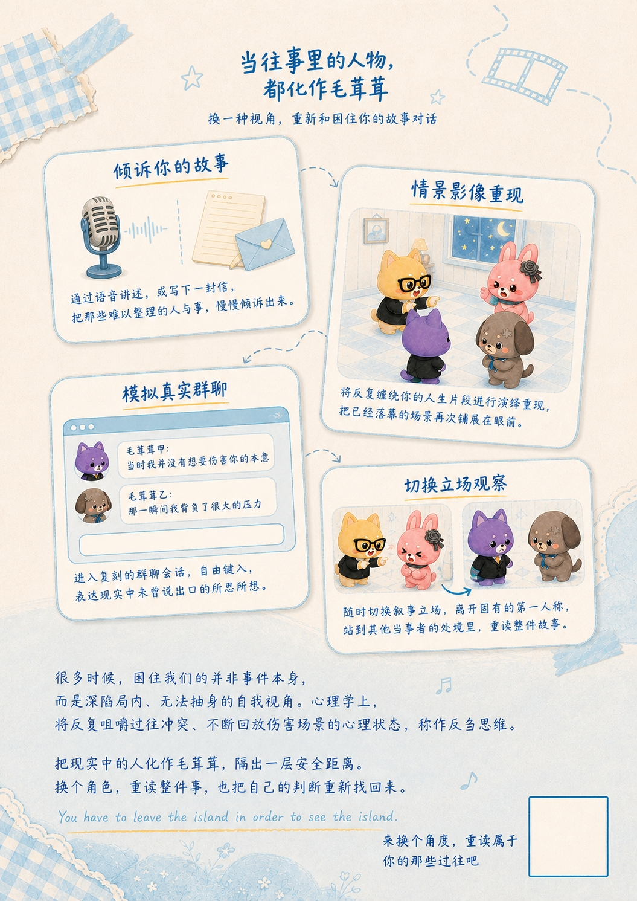
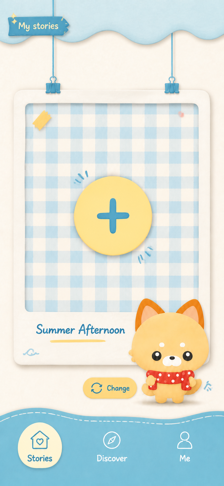
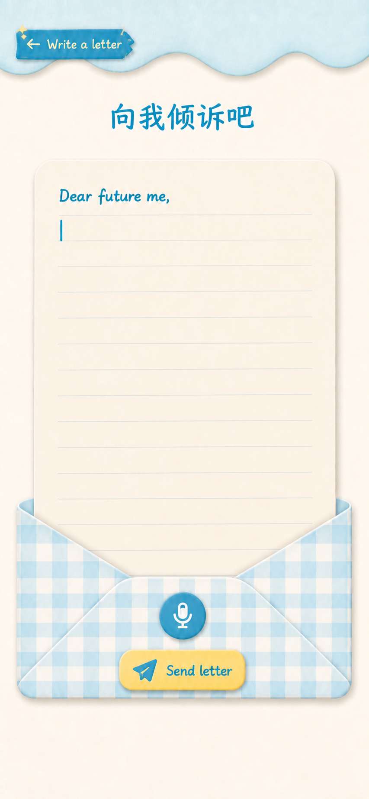
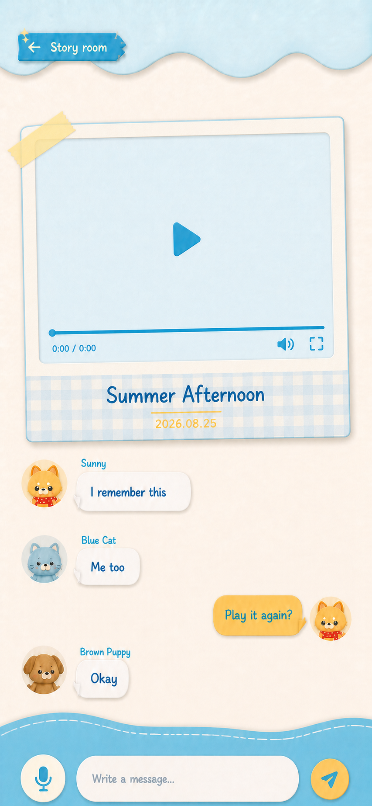
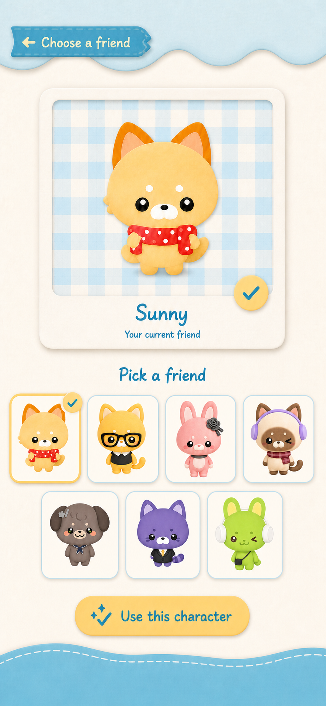
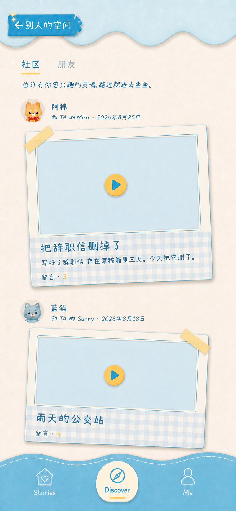
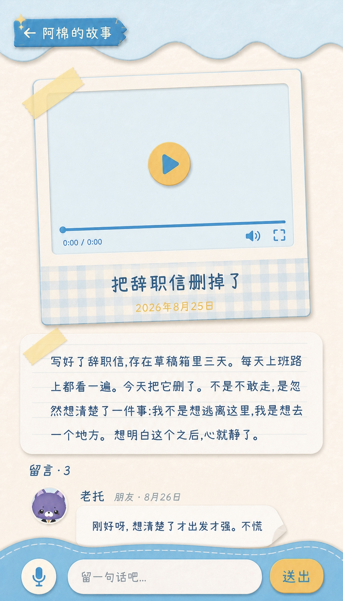
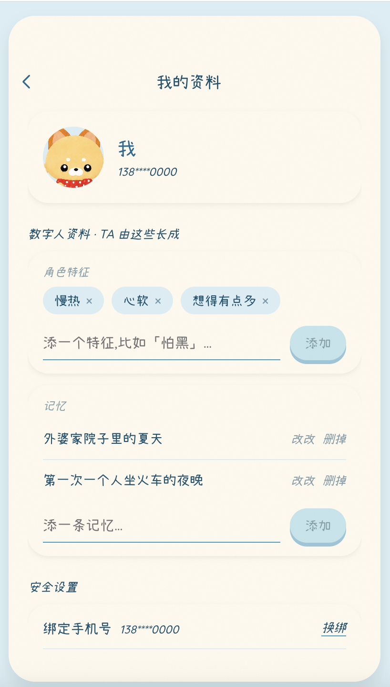
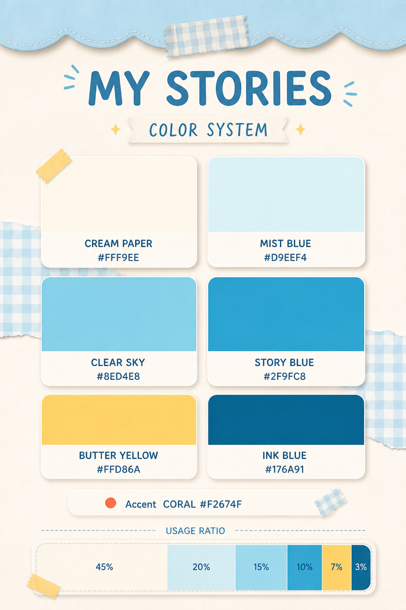

# Answer Land 项目立项书

# Answer Land

# 《我不知道您是怎么了》

**把现实里没法正常沟通的人毛茸茸化，再换个位置问一次。**

**“把我惹毛了，我就把您毛茸茸”**

## 执行摘要

**Answer Land** 是一个**面向女性真实关系困境**的 **AI 原生表达**与**换位思考**空间。用户把现实中难以直接沟通的人——老板、同事、前任、家人，甚至自己——转换成卡通角色，在 AI 情境里重新描述事件、**尝试换位并练习下一句话**。

## 项目背景说明书

### 为什么值得解决

很多关系问题没有标准答案。现实中真正阻碍行动的，往往不是信息不足，而是用户被困在当事人视角：情绪太近、表达成本太高、对方不愿沟通，或者用户害怕一开口就让关系进一步恶化。

- 搜索和内容社区提供大量他人经验，但难以贴合用户自己的事件细节。
- 朋友建议通常带有立场，容易把猜测说成事实，或直接推动用户做决定。
- 通用 AI 擅长回答问题，却容易停留在长篇建议，没有形成可体验、可练习、可回到现实的闭环。
- 心理咨询具有专业价值，但并非所有日常沟通困境都需要或能够立即进入专业服务。

### 女性主题的真实切口

女性并不是因为“更情绪化”而需要这款产品。更准确的切口是：在亲密关系、家庭、职场和同辈关系中，女性常常被期待理解他人、维护气氛、控制表达，同时又要承担“是不是我想多了”的自我怀疑。她们获得了很多建议，却缺少一个不被评判、可以验证感受并练习边界的空间。

**我们不替她决定。** 产品不承诺看穿对方，不要求用户理解或原谅任何人，也不把 AI 的角色推演包装成真实心理。它帮助用户区分事实、感受、猜测和未知，把选择权交还给用户。

## 产品概念与核心叙事

### 产品概念

Answer Land 是一款“**毛茸茸角色转译驱动的 AI 多视角情境推演产品**”。用户通过文字或语音输入一段真实困境，选择要处理的关系对象和卡通形象；Answer Land 把事件进行视觉化处理并生成视频图像，让用户与毛茸茸角色展开一轮可换位、可重来的情境推演，最后生成现实行动卡。

### 核心叙事

现实里说不出口的话，可以换一个毛茸茸的身份再说。

当一件事把人“惹毛”时，用户缺少的可能不是更多建议，而是暂时离开原来的位置、重新看见它的机会。毛茸茸魔法把令人紧张的现实关系转换成安全距离：老板可以变成紫色西装猫，前任可以变成一只看似无辜的萨摩耶，妈妈可以变成拿着保温杯的橘猫，而用户自己也可以被温柔地抱回毛茸茸。

真正的产品价值发生在转换之后：AI 帮助用户确认发生了什么、哪些只是猜测；再以“对方的一种可能视角”而不是“对方真实想法”参与推演；用户练习新的表达，确认需要、边界和下一步，然后回到现实。

## 用户目标与核心场景

### 首发用户假设

| 纬度 | 首发假设 |
|---|---|
| 人口特征 | 22–35 岁成年女性；一二线及强二线城市优先；年龄不是唯一筛选条件 |
| 情景特征 | 正在经历关系冲突、冷淡期、边界沟通、去留选择或职场难沟通 |
| 行为特征 | 会搜索关系问题、保存情感内容、向朋友或 AI 求助、反复回看聊天记录 |
| 核心障碍 | 建议很多但无法行动；害怕表达错误；把猜测当事实；不清楚自己的真实需要 |
| 高意图时刻 | 刚吵完、准备发消息、见面前、要提离职/分手/边界、夜间反复复盘时 |
| 排除边界 | 未成年人、紧急危机、需要诊断或专业治疗、暴力高风险情境不作为首发自助对象 |

### 五个内容入口

| 入口 | 用户原话 | 毛茸茸转化 | 要完成的任务 |
|---|---|---|---|
| 老板/同事 | “我不知道各位是怎么了。” | 紫色西装猫、青蛙、小狗 | 准备沟通、拒绝加活、厘清责任 |
| 前任/伴侣 | “我不知道您是怎么了。” | 萨摩耶或其他反差动物 | 区分事实与猜测、决定是否联系 |
| 同辈小团体 | “为什么总让我觉得被排除？” | 水豚、青蛙群聊 | 还原互动、练习边界表达 |
| 妈妈/家人 | “我想理解，但不想继续被控制。” | 橘猫等熟悉角色 | 表达需要、降低冲突、保留边界 |
| 我自己 | “我不知道您是怎么了。” | 自己的数字动物分身 | 识别模式、自我安抚、选择下一步 |

## 产品体验与功能架构

### 核心体验闭环

- 说出困境：用文字或语音讲述刚刚发生的真实事件。
- 还原事件：用户确认人物、事实、感受、猜测和未知；AI 允许被纠正。
- 施加魔法：为现实对象选择动物形象、昵称与沟通距离。
- 进入角色：从自己、对方的一种可能视角或旁观者位置重新看事件。
- 先演一遍：练习不同表达和选择，看到可能回应、成本和待确认信息。
- 回到现实：生成一句可说的话、一项具体行动和一个待确认问题。
- 留下痕迹：保存为私密故事；用户主动选择时，可匿名分享洞察而非原始隐私。

### 功能模块

| 模块 | 用户价值 | 范围 |
|---|---|---|
| 数字动物分身 | 形成稳定的自我角色、偏好和记忆入口 | 基础头像、特征标签、用户可编辑记忆 |
| 事件沙盘 | 把混乱叙述变成可确认的事件结构 | 人物、事实、感受、猜测、未知 |
| 毛茸茸转换器 | 降低现实对象带来的威胁感，建立心理距离 | 有限动物模板、昵称、关系标签 |
| 多视角对话 | 换位但不读心，练习新的理解与表达 | 自己/可能的对方/旁观者三种位置 |
| 行动卡 | 把体验转化为现实中的下一步 | 一句表达、一项行动、一个待确认问题 |
| 故事与空间 | 沉淀成长轨迹，在明确同意下连接相似经验 | 默认私密；匿名分享由用户主动开启 |

### 当前原型界面

## 产品功能

### 产品功能总流程

NPC agent

### 系统侧能力

主流程应围绕一个事件逐步推进：困境输入 → 事件确认 → 毛茸茸转换 → 视角选择 → 对话演练 → 行动卡 → 保存/删除/分享。每一步都必须支持“返回修改、暂时退出、继续上次进度”；用户修改上游事实后，下游视角和行动建议应重新生成，避免沿用过期推断。

## Agent & Harness 设计

LLM 逻辑、底层架构

agent-视频、人设处理、图片生成、文案的 LLM，背后的逻辑和架构，连接和 prompt 要点

## 技术方案

详见 [docs/development.md](docs/development.md)。

## 核心创新与产品价值

### 为什么不是普通聊天 AI

| 现有替代 | 用户得到什么 | 主要缺口 | Answer Land 的差异 |
|---|---|---|---|
| 搜索/内容社区 | 大量他人经验 | 信息碎片、立场极端、难以贴合本人事件 | 围绕用户自己的事件结构化推演 |
| 朋友建议 | 熟人支持与即时反馈 | 单方叙述、关系立场、隐私压力 | 不强制立场，区分事实/猜测/未知 |
| 通用 AI | 快速回答和话术 | 容易直接给结论，缺少连续体验 | 角色转译 + 换位练习 + 行动闭环 |
| AI 日记 | 记录、反思、长期洞察 | 通常不强调角色互动和现实对话 | 从记录推进到沟通演练 |
| 虚拟陪伴 | 沉浸感和关系感 | 可能停留在虚拟关系或娱乐 | 终点是回到现实并采取行动 |

### AI 原生点

- 同一段真实叙述被转换成多个可交互位置，而不是只生成一份建议。
- AI 角色明确标注为“可能视角”，并随用户纠正持续更新，不伪装成读心。
- 数字分身帮助用户识别长期重复模式，但记忆必须可查看、可修改、可删除。
- 多个功能代理可分别负责事件抽取、安全判断、视角生成和行动卡汇总，但前台只呈现一条轻量体验。

情绪距离 × 事件清晰度 × 表达练习 × 现实行动 = 用户真正获得的“走过问题的能力”。

## 安全、隐私与伦理边界

| 风险 | 可能后果 | 产品控制 |
|---|---|---|
| 把 AI 推演当成对方真实心理 | 误判关系、强化偏见 | 持续使用“可能视角”；事实/猜测分层；提醒线下确认 |
| 敏感经历泄露 | 隐私伤害与信任流失 | 默认私密、最小化采集、可删除、匿名分享需主动确认 |
| 危机或暴力情境仍自助推演 | 延误专业支持或增加危险 | 关键词与语境识别、暂停推演、引导现实求助 |
| 辱骂语气升级 | 从情绪出口滑向网络暴力 | 不生成可识别攻击内容；引导从标签回到具体行为 |
| 数字分身记忆错误 | 长期误导用户自我理解 | 记忆可查看、可编辑、可删除；标注来源与时间 |
| 过度依赖虚拟关系 | 替代现实沟通 | 会话终点必须指向现实行动或明确暂停、不以无限陪伴为 KPI |

**Answer Land 不是心理治疗、医疗诊断、危机干预或“读懂他人”的工具；毛茸茸角色不能替代现实对象的真实回应。**
